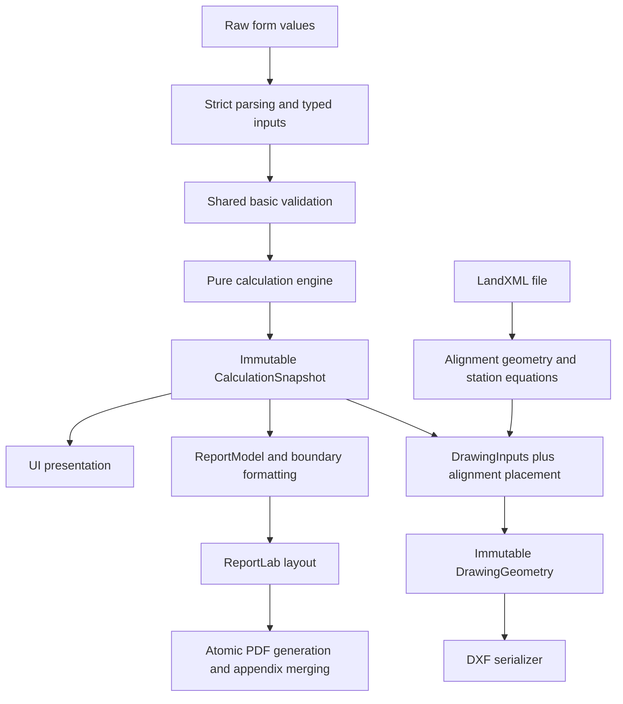

# Python Architecture

Phase 3 preserves the corrected software behavior of commit `a280080`. Regression
parity is a software contract, not approval of the engineering assumptions.

## Application pipeline

`CalculationSnapshot` holds project metadata, validated numeric inputs, and numeric
results. Output adapters use that snapshot; they do not reread engineering fields
from Tkinter or invoke the engine again. Preview callbacks may calculate a clear-zone
selection, but exported values come from the accepted calculation snapshot.

## Modules

| Module | Responsibility |
| --- | --- |
| `guardrail_V8.5.py` | Desktop launch, diagnostic logging, and compatibility exports. |
| `guardrail_design.py` | Established MDOT tables, constants, categories, and known reference metadata. |
| `guardrail_models.py` | Frozen project, roadway, barrier, calculation, alignment-selection, and export/report contracts. |
| `guardrail_parsing.py` | Complete finite-number parsing, including grouped ADT values. |
| `guardrail_validation.py` | Basic validity, authoritative opposing offsets, and roadway consistency checks. |
| `guardrail_engine.py` | Pure calculations and typed results; no UI, filesystem, or output-library dependencies. |
| `guardrail_presentation.py` | Feet/inches and filename/path formatting. |
| `guardrail_report.py` | Snapshot-to-report formatting and compatibility payload validation. |
| `guardrail_pdf.py` | Existing ReportLab page layout and rendering. |
| `guardrail_pdf_files.py` | Unique temporary files, atomic replacement, appendices, native page sizes, and bookmarks. |
| `guardrail_resources.py` | Module-relative/PyInstaller reference-PDF lookup. |
| `guardrail_alignment.py` | Lines/arcs, station equations, geometric validation, and adaptive offset sampling. |
| `guardrail_landxml.py` | XML parsing and per-alignment rejection diagnostics. |
| `guardrail_drawing.py` | Geometry, features, layers, annotations, placement extents, and supported-export checks. |
| `guardrail_dxf.py` | DXF serialization and compatibility names, including the old `DrawingModel` configuration alias. |
| `guardrail_ui.py` | Tkinter controls, input collection, snapshot orchestration, and user messages. |
| `guardrail_cli.py` | Retained optional console compatibility interface; it is not the desktop entry point. |

The modern APIs are `create_snapshot()`, `report_payload()`/`write_report()`,
`drawing_inputs()`/`build_drawing()`/`serialize_dxf()`. Numeric values stay separate
from report strings. Drawing geometry uses frozen line/text entities; the legacy
`records` interface is derived rather than stored as a second representation.

## Validation boundaries

1. **Basic data:** finite numbers, nonnegative dimensions/ADT, positive widths,
   integral positive lane counts, and internally consistent totals/roadway state.
2. **Supported exports:** positive DXF terminal length, sufficient approach extent,
   complete 75-foot taper, supported LandXML elements, and geometric sampling tolerance.
3. **Engineering applicability:** unresolved assumptions remain unchanged. The existing
   DXF-only `LA >= L2` check is retained locally; it is not a general engine/PDF rule.

## Characterization and removal evidence

`test_fixtures/phase3_baseline.json` was captured before extraction. Tests cover
2,592 numeric outputs, twelve report payloads/PDF page streams, and twelve drawing
fingerprints across facilities, layouts, straight geometry, and both arc rotations.
Additional tests cover immutable snapshots, dependency isolation, output reuse,
readonly controls, stale LandXML state, and diagnostic tracebacks.

An AST load-reference scan and repository search found no active callers of
`_ui_main_legacy()` (330 lines), `_generate_pdf_calc_sheet_legacy()` (295 lines),
`compute_x_design_from_xmin()`, or `_cross_dimension()`. The desktop entry point
called `ui_main()`, and exports called the active PDF renderer. These candidates
were removed in a separate step and the full suite rerun. Raw DXF group-code strings
were populated but never read by `save()`; serialization used `records`. That
duplicate representation was removed after drawing characterization was established.
The public console `main()` was retained rather than deleting a possible external API.

## Remaining work before a browser phase

The Tkinter layout/interaction function, PDF layout function, and installation
geometry function remain sizeable. They now have distinct responsibilities; further
internal decomposition can follow their existing characterization tests.

Independently verify these questions against MDOT source documents before changing
their behavior: traffic direction/A-B-C-D physical sides; full divided-highway geometry;
inside opposing clear-zone treatment; terminal contribution; minimum B/D; opposing
hazard geometry; complete clear-zone interpretation; flare applicability/shy-line rules;
the ADT "Over 10,000" boundary; `W = LA` versus GR-4/GR-4A Note 7; short installations;
zero terminals; and DXF-only `LA >= L2`.

Future report improvements include recording LA-selection method, reference edition,
and overrides. These are not added to calculation sheets in Phase 3. Roadway
reference-line/offset selection and spiral support also remain future features.
Before Phase 4, review the separated contracts, retain portable numeric/geometry
fixtures, and perform a normal user acceptance check of the packaged desktop build.
No HTML, JavaScript, or TypeScript conversion is included here.
